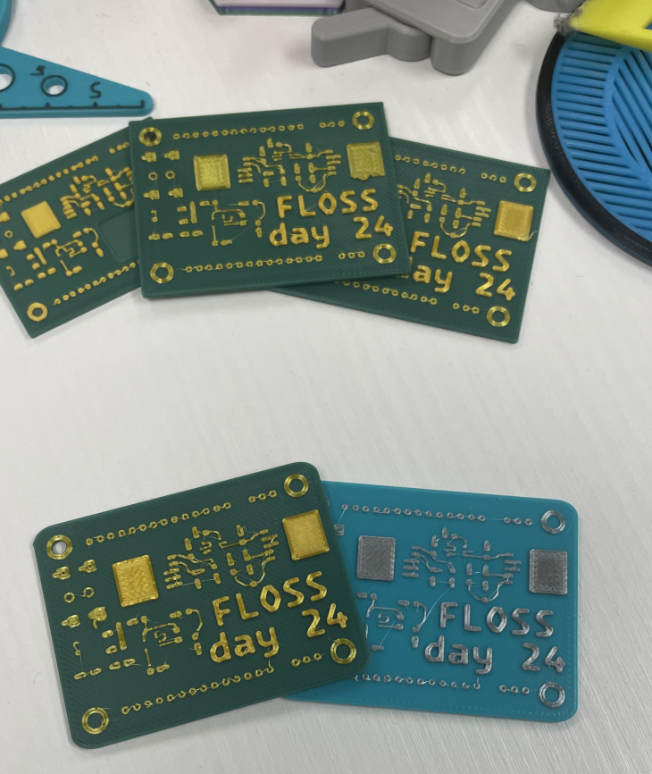
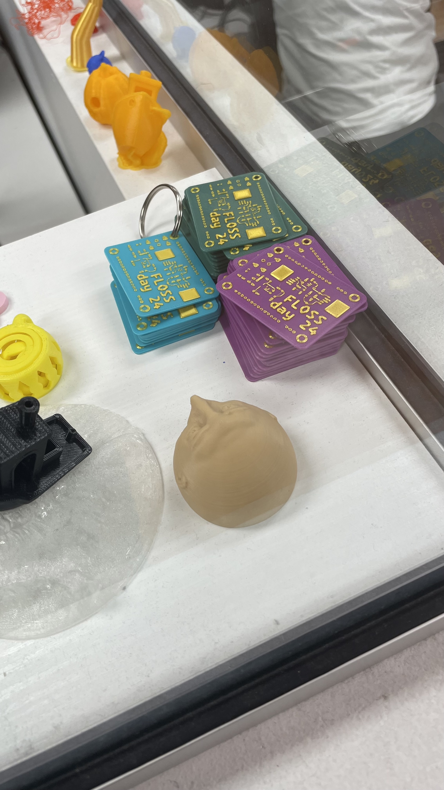

Vanier FLOSS Day 2024 
======================

[WIP] please send a PR with your contribution to improve this report!

The third edition of Vanier FLOSS Day happened on October 16th 2024, on a
Wednesday, during the school Fall break. All Vanier community was invited,
through MIOs and a [printed poster](FLOSS_day_24_poster.png). This time we
did not publicize the event outside the College, since we quickly reached our
room capacity.

Participants
==============

An online form was setup and 58 people were registered prior to the event. On
the day, 44 people checked in: 

- Vanier community:
  - 10 Computer Science and Mathematics (CSM) students
  - 22 Computer Science and Technology (CST) students
  - 1 Vanier CS student (did not specify the program)
  - 2 Alumni
  - 3 Computer Science teachers
  - 1 Computer Engineering teacher
  - 1 Makerspace technician

- Outside from Vanier (guest speakers):
  - 2 McGill students (McGill Open Mapping Group)
  - 2 FLOSS developers (Tor and Debian projects)

This time we had less program diversity than last year, when several students from non-CS regular programs also attended the meeting. Among the cancellations and no-shows for this year, we had several students from Health Sciences, Electrical Engineering and CS continuing education programs. Something to strive for next year: keep those participants engaged until the day of the event.

Swag
====

All participants took home a FLOSS Day 3D printed keychain. On top of that,
a selection of FLOSS project stickers were printed and made available.

### 3D Printed Keychain (by Qian Qian)

The keychain is based on a Tinkercad design of [IronGears10](https://www.tinkercad.com/things/iPPfRoUBe1q-3d-pcb-layout) licensed under CC BY-SA 3.0. There are some modification done. Final Tinkercad is shared [here](https://www.tinkercad.com/things/lqzVt5o8N8M-vanier-floss-day-swag-3d), and you can find the final design in form of the Prusa Slicer project (`3mf`) in this repo.

We had a few prototypes experimenting corner design and color matching; and finally the design preview of the final design.
|  |  |
| -------------- | --------------- |
| 3d swag prototypes | final design preview |

Then the final design was produced in batch by Vanier Makerspace and got ready before the FLOSS Day.

| |  |
| -------------- | --------------- |
| mass production | 3d keychain |

### FLOSS stickers (by Manas Patel and Anghelos Coulon)

We have also produced some stickers to give away. A couple of original designs for the FLOSS Day, and a few other official logos from FLOSS projects.

Schedule
==========

For the first time we had a pre-determined schedule. Here are the highlights:
- 2 intro sessions about FLOSS and how to contribute
- 2 guest talks: OpenStreetMap project (OSM) in the morning and Tor project in
the afternoon.
- 6 UNIX course students presented about GNU/Linux distributions
- a 7-speakers Lightning Talks session, where each participant had 3 min to share about a cool FLOSS project
- 3 hands-on workshops in parallel: OSM, Git, Debian packaging 

| Time | Activity | Speaker |
| -------------- | --------------- | --------------- |
| 09:30 | Mingling and coffee time | |
| 10:00 | [Welcome & Intro to FLOSS](presentations/flossday24_intro.pdf) | Tassia Camoes-Araujo |
| 10:30 | [How to contribute to FLOSS projects](presentations/floss_get_started.pdf) | Qian Qian |
| 11:00 | [Introduction to OpenStreetMap](OSM.pdf) and [open-source mapping](presentations/OSM_and_GIS.pdf) | Jenny Zhu and Nicholas Foisy |
| 12:00 | Parrot Security | Kais Rafie |
| 12:30 | GNU/Linux demo, by UNIX course students: | |
|       | - Kali Linux | Ibrahim El Zeftawy |
|       | - [Raspberry Pi](presentations/Raspberry_Pi.pdf) | Aya Kharchafi |
|       | - OpenSUSE | Lydia Ayala Hernandez |
|       | - Tails | Yakin Succès |
|       | - Arch Linux | Alexander Nguyen |
| 13:00 | Lunch & Group photo | |
| 14:00 | [The Tor Project](presentations/Tor/Tor_internet_surveillance.pdf) | Antoine Beaupré |
| 15:00 | Lightning talks/demos | |
|       | - [Ungoogled-chromium](https://github.com/ungoogled-software/ungoogled-chromium) | Qian Qian |
|       | - [Godot](presentations/godot_notes.md) | Alexandru Cirlan |
|       | - Security Do's and Don't | Nabil Ramadan |
|       | - Tasker | Ali |
|       | - [Open-source AI](presentations/open_source_ai.pdf) | Le Tuan Huy Nguyen |
|       | - Makefiles | Giuliana Bouzon | 
|       | - Arduino | Manas Patel | 
| 15:30 | Workshops | |
|       | - [Hands-on Git](presentations/Git_workshop.pdf) | Andrei Popescu |
|       | - [Debian Packaging](presentations/debian_packaging_tutorial.pdf) | Tiago Vaz |
|       | - Introduction to mapping with OpenStreetMap | Jenny Zhu and Nicholas Foisy |
| 17:00 | Final words | |

Drawing robot
===============

The Tor project logo was being "cooked" by a robot as presentations were taking place, and by the
end of the day participants could appreciate the beautiful onion logo.

Lunch and snacks
================

Snacks: coffee, fruits and pastries
Lunch: pizza, the easiest to handle dietary restrictions

Testimonials
============

*What did you learn? Did you have fun? How was the logistics (e.g. food)?*

>

Lessons for future events
=========================

*What could go better the next time?*

> Tassia: put signs on the wall the day before and plan better to have the
> check-in station ready as early as possible

Organization Team
==================

The FLOSS Day is organized by the Vanier FLOSS Club, with the
help of friends from the Vanier CSSA (Computer Science Students Association), as
well as the STEM Center, including the Robotics team.

This is the list of people who participated in orga meetings:
- Tassia
- Justin
- Qian
- Alex
- Ali
- Vassia
- Ibrahim
- Kais
- Manas
- Andrei
- Aya
- Ahmet
- Anghelos

Acknowledgement
===============

This event would not be possible without the support and participation of many,
so MANY THANKS to...

- Vanier College
- Faculty of Science and Technology
- STEM Center
- FLOSS Day 24 orga team 
- Speakers
- Participants
